<div align="center">


<br/>


<br/><br/>

<a href="https://sudharshan-portfolio-delta.vercel.app/"></a>
<a href="https://www.linkedin.com/in/sudharshan-murugan-8323b4241/"></a>
<a href="https://mail.google.com/mail/?view=cm&fs=1&to=sudharshan100002@gmail.com" target="_blank">
  
</a>
<a href="https://github.com/SUdharshanMURUGA"></a>

</div>

<br/>

> ### *"Data means nothing until it's structured, trustworthy, and moving somewhere useful. I build the systems that get it there."*

<br/>

## 👋 About Me

I started out building interfaces as a **Frontend Developer**, moved into **AI/ML engineering** to work on model-driven applications, and grew into a **Full-Stack Developer** comfortable across the entire application layer. That path naturally led me toward **Data Engineering** — because every frontend, every model, and every full-stack app is only as good as the data feeding it, and I wanted to own that layer too.

Today I work as a Data Engineer at **Tata Consultancy Services**, within the **Liberty Mutual Insurance** account — designing ETL workflows, data models, and integrations that support enterprise-scale analytics. I hold an M.Sc. in Computer Science (CGPA 9.19) and graduated top of my undergraduate class with a Gold Medal in B.Sc. Computer Science (CGPA 9.55).

<div align="center">

```
   Frontend Developer   →   AI/ML Engineering   →   Full-Stack Developer
                                    ↓
                          ┌───────────────────┐
                          │  DATA ENGINEERING │
                          └───────────────────┘
```

</div>

<br/>

## 🏗️ How I Think About Data Systems

```mermaid
flowchart LR
    A["APIs / CSV / DBs"] --> B["Ingestion"]
    B --> C["Transformation (ETL)"]
    C --> D["Data Quality Checks"]
    D --> E["Warehouse / Storage"]
    E --> F["Analytics & Insights"]

    style A fill:#0f172a,stroke:#0891b2,color:#e2e8f0
    style B fill:#1e293b,stroke:#0891b2,color:#e2e8f0
    style C fill:#1e3a8a,stroke:#6366f1,color:#e2e8f0
    style D fill:#1e3a8a,stroke:#6366f1,color:#e2e8f0
    style E fill:#164e63,stroke:#0891b2,color:#e2e8f0
    style F fill:#0f172a,stroke:#0891b2,color:#e2e8f0
```

<div align="center">



</div>

<br/>

## 🧰 Tech Stack

**✅ Working With**


`Python` `SQL` `ETL/ELT` `Pandas` `MySQL` `MongoDB` `Git` `Postman`

**🌱 Currently Learning**


`Advanced SQL` `Apache Airflow` `PySpark` `AWS` `Data Warehousing` `Data Modeling` `Distributed Processing` `React.js`

**🔭 Exploring**


`TensorFlow` `Scikit-learn` `OpenCV` `TypeScript` `Tailwind CSS` `Docker`

<sub>I'm intentionally splitting this into three tiers rather than one long list — what I ship with in production, what I'm actively building depth in, and what I've touched but don't claim expertise in.</sub>

<br/>

## 🔭 Currently Working On

- 🌦️ **Weather ETL Pipeline** — a Python ETL project (extract → transform → load → dashboard) built to practice pipeline fundamentals end-to-end
- 📊 SQL analytics practice on real-world-style datasets
- ⚙️ Small data pipeline automation scripts

## 🌱 Currently Learning

Advanced SQL &nbsp;•&nbsp; PySpark &nbsp;•&nbsp; Apache Airflow &nbsp;•&nbsp; AWS &nbsp;•&nbsp; Data Warehousing &nbsp;•&nbsp; Data Modeling &nbsp;•&nbsp; Distributed Data Processing &nbsp;•&nbsp; Data Engineering System Design

## 🤝 Open to Collaborate On

Data Engineering projects &nbsp;•&nbsp; ETL/ELT pipelines &nbsp;•&nbsp; Python & SQL projects &nbsp;•&nbsp; Open-source contributions &nbsp;•&nbsp; AI/ML side projects

<br/>

## 📌 Featured Projects

<table>
<tr>
<td width="50%" valign="top">

### 🩺 Lung Cancer Detection System
ML-driven Flask application using an EfficientNet-B0 CNN to analyze CT scans and support preliminary lung cancer screening, with a visual results dashboard.

`Python` `Flask` `TensorFlow` `OpenCV` `EfficientNet-B0`

</td>
<td width="50%" valign="top">

### 📦 Stock Management System
Inventory management application with CRUD operations, real-time updates, and reporting to reduce manual tracking errors.

`VB.NET` `MySQL`

</td>
</tr>
</table>

<br/>

## 🚀 Data Engineering Lab

*A running collection of Data Engineering projects — updated continuously as each one ships.*

| Project | Status | Technologies |
| ------- | ------ | ------------ |
| 🌦️ [Skyline Ledger](https://sudharshanmuruga.github.io/Skyline-Ledger-weather/) | 🟢 Live | ETL · Data Validation · Data Quality · REST API |
| 📊 SQL Analytics Project | 🕒 Coming Soon | SQL, Data Modeling |
| 🏢 Data Warehouse Project | 🕒 Coming Soon | SQL, Data Warehousing |
| ⚡ PySpark Data Processing | 🕒 Coming Soon | PySpark, Distributed Processing |
| 🔁 Airflow Pipeline Project | 🕒 Coming Soon | Apache Airflow, Orchestration |
| ☁️ Cloud Data Engineering Project | 🕒 Coming Soon | AWS, Cloud Data Platforms |

<sub>Nothing here is marked complete unless it actually is — this table updates as each project lands.</sub>

<br/>

## 📊 GitHub Stats


<div align="center">


</div>

<div align="center">

</div>

<div align="center">

</div>

<div align="center">
<a href="https://github.com/ryo-ma/github-profile-trophy">

</a>
</div>

<div align="center">

</div>

<br/>

## 🏅 Achievements & Certifications

**Achievements**
🥇 Gold Medal — B.Sc. Computer Science &nbsp;•&nbsp; 🎓 M.Sc. Computer Science, CGPA 9.19 &nbsp;•&nbsp; 🎓 B.Sc. Computer Science, CGPA 9.55 &nbsp;•&nbsp; 💼 Data Engineer, TCS — Liberty Mutual Insurance domain

**Certifications**
Python (GUVI) &nbsp;•&nbsp; Supervised Machine Learning (Stanford Online/Coursera) &nbsp;•&nbsp; HTML/CSS/JS Essentials (LinkedIn Learning) &nbsp;•&nbsp; MySQL Basics (Great Learning) &nbsp;•&nbsp; Core Java (Besant Technologies) &nbsp;•&nbsp; ISRO LULC Mapping Project (ML)

<br/>

<div align="center">

*Data is everywhere. I care about the part most people skip — making sure it's clean, structured, and actually trustworthy before anyone builds on top of it.*


</div>
